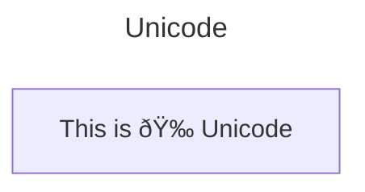

## Basic Node

Basic Node (instead of `flowchart`, we can use `graph`)

## Node with Text

Use `"` to enclose the unicode text

Markdown formatting 

> Per 10 November 2023, only work for **Mermaid Live Editor** & **Markdown Preview Mermaid Support VSCode Extension**

## Direction

