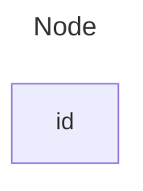
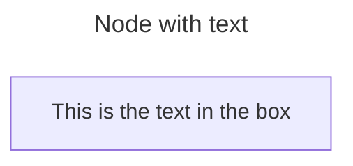
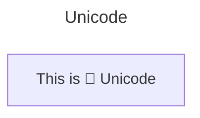
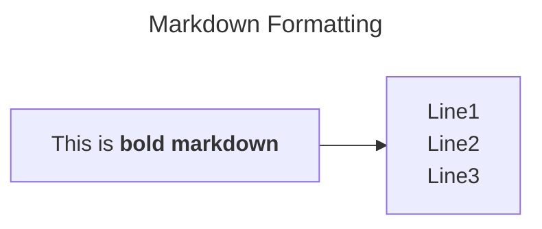
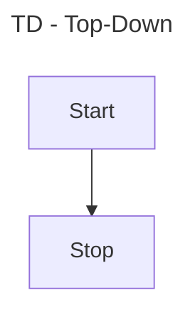
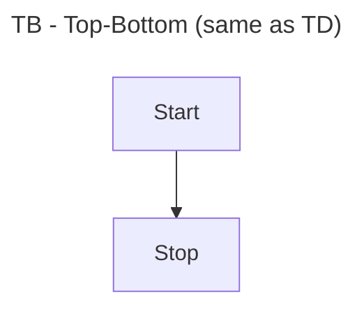
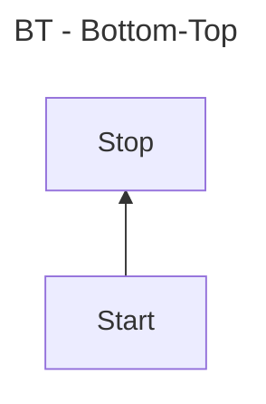
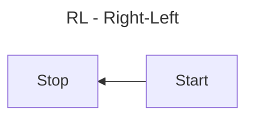
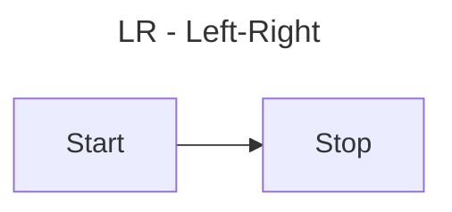

## Basic Node

```mermaid
---
title: Node
---

flowchart LR
    id
```

Basic Node (instead of `flowchart`, we can use `graph`)

```mermaid
---
title: Node
---

graph LR
    id
```

## Node with Text

```mermaid
---
title: Node with text
---

graph LR
    id1[This is the text in the box]
```

Use `"` to enclose the unicode text

```mermaid
---
title: Unicode
---

graph LR
    id["This is 🍉 Unicode"]
```

Markdown formatting

```mermaid
---
title: Markdown Formatting
---

graph LR
    markdown["`This is __bold markdown__`"]
    newLines["`Line1
    Line2
    Line3`"]

    markdown --> newLines
```

## Direction

```mermaid
---
title: TD - Top-Down
---

graph TD
    Start --> Stop
```

```mermaid
---
title: TB - Top-Bottom (same as TD)
---

graph TB
    Start --> Stop
```

```mermaid
---
title: BT - Bottom-Top
---

graph BT
    Start --> Stop
```

```mermaid
---
title: RL - Right-Left
---

graph RL
    Start --> Stop
```

```mermaid
---
title: LR - Left-Right
---

graph LR
    Start --> Stop
```