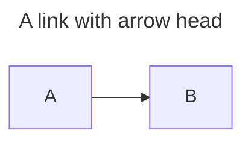
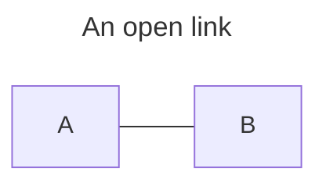
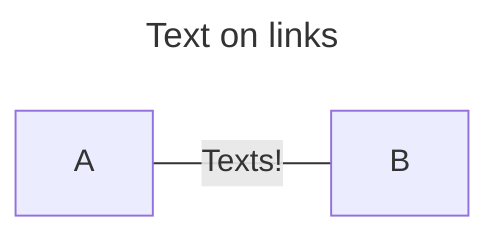
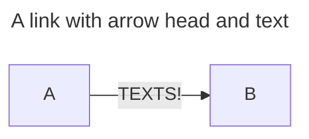
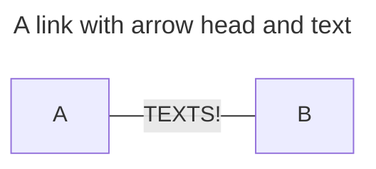
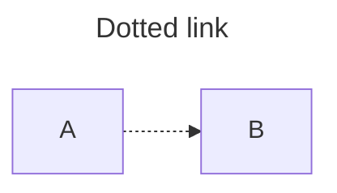
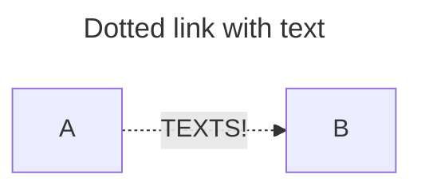

# Links between Nodes

## A link with arrow head

```mermaid
---
title: A link with arrow head
---

graph LR
    A-->B
```

## An open link

```mermaid
---
title: An open link
---

graph LR
    A---B
```

## Text on links

```mermaid
---
title: Text on links
---

graph LR
    A-- Texts! ---B
```

```mermaid
---
title: Text on links
---

graph LR
    A---|Texts!|B
```

## A link with arrow head and text

```mermaid
---
title: A link with arrow head and text
---

graph LR
    A-->|TEXTS!|B
```

```mermaid
---
title: A link with arrow head and text
---

graph LR
    A-- TEXTS! ---B
```

## Dotted link

```mermaid
---
title: Dotted link
---

graph LR
    A-.->B
```

## Dotted link with text

```mermaid
---
title: Dotted link with text
---

graph LR
    A-. TEXTS! .->B
```
