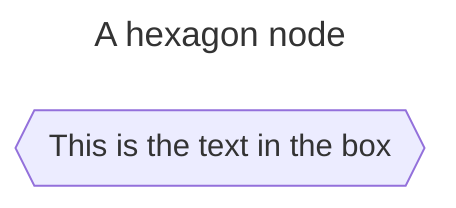
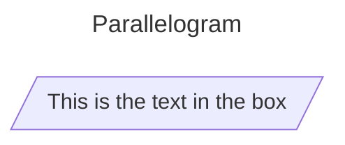
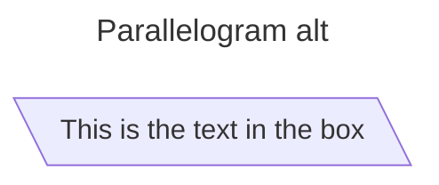
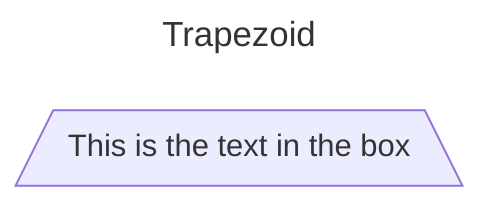
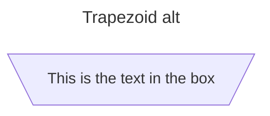
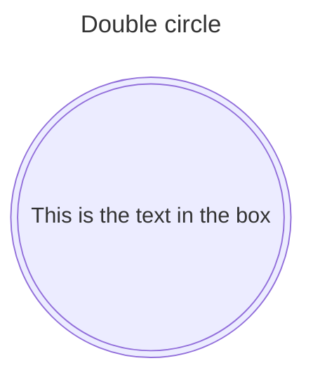

## Node Shapes

### A node with round edges

### A stadium-shaped node

### A node in a subroutine shape

### A node in a cylindrical shape

### A node in the form of a circle

### A node in an asymmetric shape

### A node (rhombus)

### A hexagon node

### Parallelogram

### Parallelogram alt

### Trapezoid

### Trapezoid alt

### Double circle

